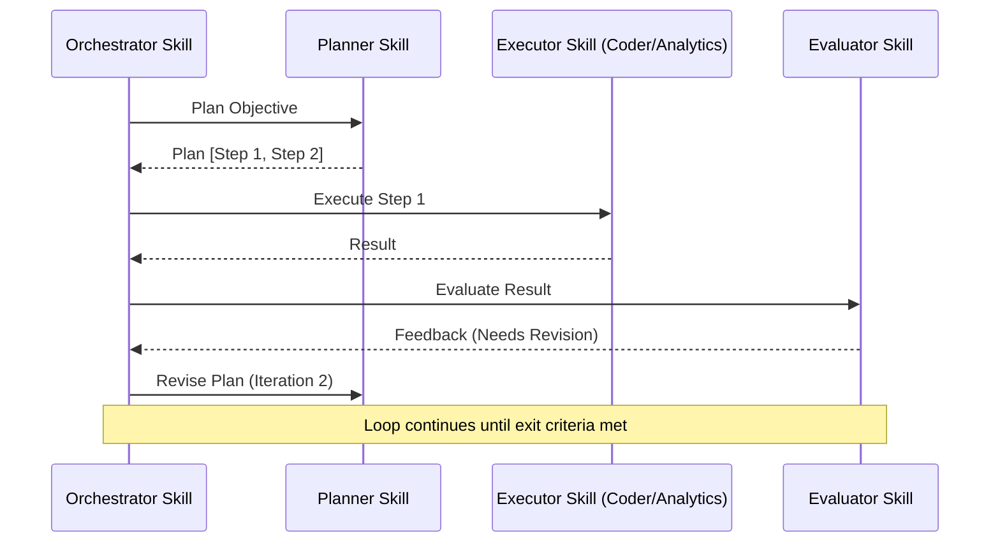
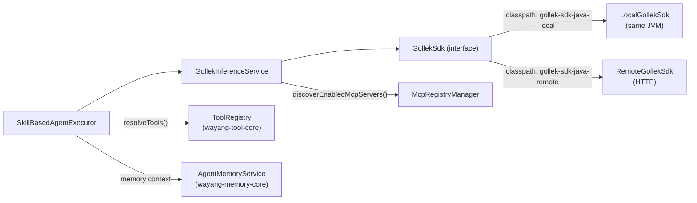

# Agent Skills

Wayang AI has moved from a hardcoded agent-type architecture to a **Skill-Based Agent Architecture**. This allows for highly flexible, data-driven agent personas and multi-agent orchestration without changing backend code.

---

## 💡 The Concept

In traditional architectures, each agent type (e.g., "coder", "planner") requires a dedicated Java class or service. Wayang's **Skill-Based** approach separates the *Agent Mechanism* from the *Agent Persona*.

- **The Skill**: A JSON definition containing the system prompt, model parameters (temperature, max tokens), and provider preferences.
- **The Executor**: A unified engine (`SkillBasedAgentExecutor`) that loads these skills and acts as the persona defined in the JSON.

This means you can create a "Security Expert" or a "Keycloak Specialist" just by writing a JSON file.

---

## 🛠️ Unified Skill Definition

A skill is defined by a simple JSON structure. Here is an example of the built-in `coder` skill:

```json
{
  "id": "coder",
  "name": "Code Generation Specialist",
  "description": "Expert in software architecture and implementation",
  "category": "built-in",
  "systemPrompt": "You are an expert software engineer. Your goal is to provide high-quality, maintainable code...",
  "subSkillPrompts": {
    "GENERATE": "Generate the following code based on the instructions...",
    "REVIEW": "Review the following code for bugs or performance issues...",
    "REFACTOR": "Refactor the following code to improve readability..."
  },
  "temperature": 0.2,
  "maxTokens": 4096,
  "tools": ["file_read", "file_write", "terminal_execute"]
}
```

### Key Components

- **System Prompt**: Defines the base persona and instruction set.
- **Sub-Skill Prompts**: Specialized instructions for different task types (e.g., different prompts for writing vs. reviewing code).
- **Parameters**: Default `temperature` and `maxTokens` tailored to the specific skill's needs.
- **Tools**: List of capabilities the agent can access. *When tools are defined on a skill, Wayang's `SkillBasedAgentExecutor` automatically engages the [ReAct Tool Execution](./react-mechanism) loop to autonomously execute those capabilities during generation!*

---

## 🏗️ Built-in Skills

Wayang comes with a set of optimized built-in skills that replace the legacy agent modules:

| Skill ID | Description |
|----------|-------------|
| `common` | General purpose assistant for broad tasks. |
| `coder` | Specialized in coding, debugging, and refactoring. |
| `planner` | Specialized in breaking down complex goals into steps. |
| `analytics` | Expert in data analysis, SQL, and logical reasoning. |
| `evaluator` | Specialized in verifying outputs against criteria. |
| `orchestrator` | Control-plane skill that manages multi-agent loops. |

---

## 🔄 Orchestration with Skills

The **Orchestrator** is now a specialized skill that can delegate tasks to any other skill. This creates a powerful, recursive architectural pattern.

### Sequence Diagram: Loop Pattern



---

## 🚀 Creating Custom Skills

Custom skills can be registered at runtime via the `SkillRegistry` API or by placing JSON files in the `skills/` directory.

```json
{
  "id": "security-expert",
  "name": "AppSec Specialist",
  "systemPrompt": "You are a Senior Security Engineer specializing in OWASP Top 10...",
  "temperature": 0.1
}
```

Once registered, you can target this skill in your `WayangSpec` simply by referring to its `id`.

## Architecture After Changes

---

[Back to Documentation](/docs/)
