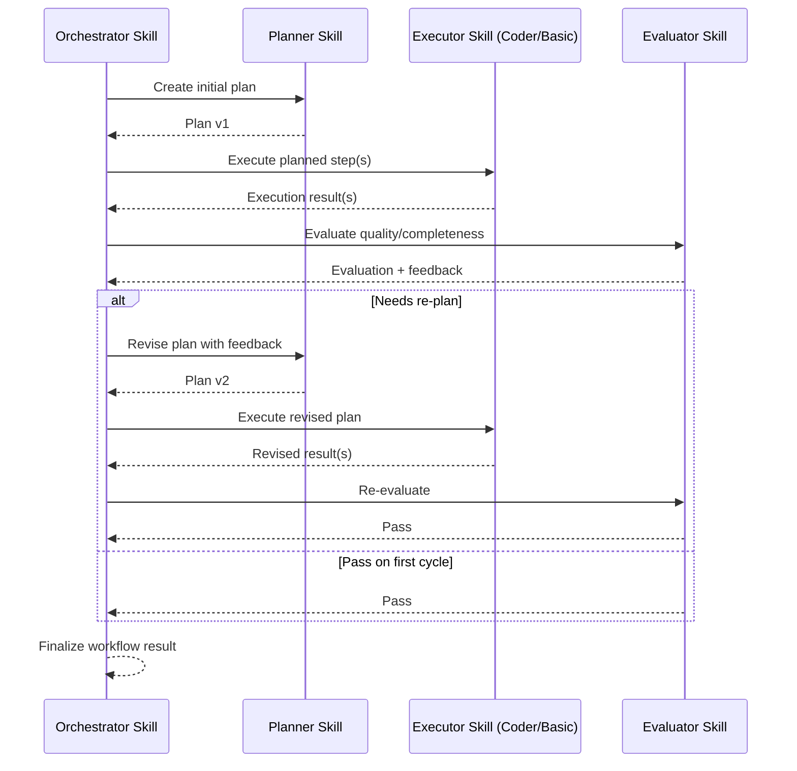

# Documentation

Get started with Wayang AI and learn how to build powerful AI agent workflows.

---

## Deep Dive Guides

- [Agent Skills](./agent-skills)
- [ReAct Tool Execution](./react-mechanism)
- [Gollek SDK Gateway & SPI](./sdk-gateway)
- [Agent Audit Mechanism](./audit-mechanism)
- [Wayang Kulit User Guide](./designer-user-guide)
- [Wayang Kulit Release Notes](./designer-release-notes)
- [Schema Catalog and WayangSpec](./schema-catalog)
- [Projects API](./projects-api)
- [Trigger Integrations](./triggers)
- [HITL Execution Flow](./hitl)
- [RAG API](./rag)
- [MCP API Coverage](./mcp)
- [Guardrails API & Execution](./guardrails)
- [Execution Telemetry API](./telemetry-api)
- [Execution Debugger API](./debugger-api)
- [Standalone Troubleshooting](./standalone-troubleshooting)
- [Testing Coverage](./testing-coverage)

---

## Quick Start Guide

### 1. Installation

Install the Wayang AI CLI tool:

```bash
npm install -g @wayang-ai/cli
```

Or use npx for one-off commands:

```bash
npx @wayang-ai/cli
```

### 2. Create Your First Project

```bash
# Create a new project
wayang create my-first-workflow

# Navigate to the project
cd my-first-workflow
```

### 3. Configure Your API Keys

Set up your AI provider credentials:

```bash
# For OpenAI
wayang config set OPENAI_API_KEY your-api-key

# For Anthropic
wayang config set ANTHROPIC_API_KEY your-api-key
```

### 4. Create a Simple Workflow

Create a file named `workflow.yaml`:

```yaml
name: Hello World
description: A simple greeting workflow

agents:
  - id: greeter
    type: llm
    model: openai/gpt-4
    prompt: "Greet the user and ask how you can help them today."

execution:
  start: greeter
```

### 5. Run Your Workflow

```bash
# Development mode with hot reload
wayang dev

# Or run once
wayang run workflow.yaml
```

---

## Core Concepts

### Agents & Skills

Agents are the building blocks of Wayang AI workflows. In the latest architecture, agents are driven by **Skills** — data-driven personas defined in JSON.

- **Skills** define the persona, system prompts, and parameters.
- **Native Vector Search (FAISS)** - JDK 25 powered high-performance memory and RAG backend.
- **Unified Executor** handles the inference logic for all skills.
- **Dynamic** - Create new agent personas without code changes.

For a detailed look at the architecture, see the [Agent Skills Guide](./agent-skills).

#### Orchestrator Loop Pattern

In multi-agent execution, the **orchestrator-skill** managing the control-plane coordination:

1. **planner-skill** creates or revises plan steps
2. **execution skills** run plan steps (`coder`, `analytics`, etc.)
3. **evaluator-skill** assesses outputs and quality
4. **orchestrator-skill** decides continue, retry, or re-plan

This pattern keeps specialized logic in individual skills while loop state stays centralized in the orchestrator.



#### Built-in Skill Aliases

The following built-in skills are available:

| Canonical ID | Aliases |
|---------|-------------|
| `planner` | `planner-agent`, `agent-planner` |
| `coder` | `coder-agent`, `agent-coder` |
| `analytics` | `analytics-agent`, `agent-analytic` |
| `evaluator` | `evaluator-agent`, `agent-evaluator` |
| `common` | `common-agent`, `agent-basic` |

#### Typed Inputs by Agent Type

For schema-driven execution payloads, these typed fields are available and recommended:

- basic (`agent-basic`): generic common-task context + shared provider/vault fields
- coder (`agent-coder`): `instruction`, optional `taskType` (default: `GENERATE`)
- analytic (`agent-analytic`): `question`, optional `taskType` (default: `DESCRIPTIVE`)
- planner (`agent-planner`): `goal`, `strategy` (also supports `objective` / `instruction`)
- evaluator (`agent-evaluator`): `candidateOutput`, `criteria` (fallbacks: `output` / `result` / `content`)
- orchestrator (`agent-orchestrator`): `objective` or `agentTasks` with `orchestrationType` / `coordinationStrategy`, and loop budgets `maxIterations` / `maxDelegations` / `maxLatencyMs` / `maxAgentLatencyMs` / `maxRetriesPerDelegation`

These fields are exposed in `/v1/schema/catalog` and validated by runtime schema/API and executor tests.

Example orchestration payload (planner -> coder -> evaluator -> planner re-plan):

```json
{
  "orchestrationType": "SEQUENTIAL",
  "coordinationStrategy": "CENTRALIZED",
  "agentTasks": [
    { "agentType": "planner-agent", "context": { "step": "plan-v1" } },
    { "agentType": "coder-agent", "context": { "step": "execute" } },
    { "agentType": "evaluator-agent", "context": { "step": "evaluate" } },
    { "agentType": "planner-agent", "context": { "step": "plan-v2" } }
  ]
}
```

### Workflows

Workflows define how agents collaborate to achieve a goal.

```yaml
workflow:
  name: Research Assistant
  agents:
    - researcher
    - writer
    - reviewer
  
  flow:
    - researcher -> writer
    - writer -> reviewer
    - reviewer -> (end)
```

### Tools

Tools extend agent capabilities with external integrations.

```yaml
tools:
  - name: web_search
    type: builtin
    provider: google
  
  - name: database
    type: custom
    connection: postgres://localhost/mydb
```

---

## CLI Reference

| Command | Description |
|---------|-------------|
| `wayang create <name>` | Create a new project |
| `wayang dev` | Start development server |
| `wayang run <workflow>` | Execute a workflow |
| `wayang deploy` | Deploy to production |
| `wayang logs` | View execution logs |
| `wayang config` | Manage configuration |
| `wayang agents` | List available agents |
| `wayang --help` | Show help information |

---

## Configuration Reference

### Environment Variables

```bash
# Required
WAYANG_API_KEY=your-wayang-api-key

# AI Providers
OPENAI_API_KEY=sk-...
ANTHROPIC_API_KEY=sk-ant-...
GOOGLE_API_KEY=...

# Optional
WAYANG_LOG_LEVEL=debug
WAYANG_PORT=3000
WAYANG_ENV=development
```

### Standalone Runtime Logging

Wayang Standalone writes server logs to:

```bash
~/.wayang/logs/server/server.log
```

Default severity is `INFO` (which includes `INFO`, `WARN`, and `ERROR` messages).

You can configure logging using environment variables:

| Variable | Default | Description |
|---------|---------|-------------|
| `WAYANG_LOG_LEVEL` | `INFO` | Root log severity |
| `WAYANG_LOG_LEVEL_TECH_KAYYS` | `${WAYANG_LOG_LEVEL}` | Log level for `tech.kayys.*` |
| `WAYANG_LOG_LEVEL_QUARKUS` | `WARN` | Log level for `io.quarkus.*` |
| `WAYANG_LOG_LEVEL_GGUF_MIN` | `INFO` | Minimum level for GGUF converter logs |
| `WAYANG_LOG_FILE_ENABLED` | `true` | Enable/disable file logging |
| `WAYANG_SERVER_LOG_DIR` | `~/.wayang/logs/server` | Server log directory |
| `WAYANG_LOG_FILE_PATH` | `${WAYANG_SERVER_LOG_DIR}/server.log` | Server log file path |
| `WAYANG_LOG_FILE_LEVEL` | `${WAYANG_LOG_LEVEL}` | File log severity |
| `WAYANG_LOG_FILE_FORMAT` | `%d{yyyy-MM-dd HH:mm:ss,SSS} %-5p [%c{2.}] (%t) %s%e%n` | File log pattern |
| `WAYANG_LOG_ROTATE_MAX_FILE_SIZE` | `20M` | Rotation size threshold |
| `WAYANG_LOG_ROTATE_MAX_BACKUP_INDEX` | `10` | Number of retained rotated files |

Example:

```bash
export WAYANG_LOG_LEVEL=WARN
export WAYANG_SERVER_LOG_DIR=$HOME/.wayang/logs/server
export WAYANG_LOG_FILE_PATH=$WAYANG_SERVER_LOG_DIR/server.log
export WAYANG_LOG_ROTATE_MAX_FILE_SIZE=50M
export WAYANG_LOG_ROTATE_MAX_BACKUP_INDEX=20
```

### Project Configuration (wayang.config.js)

```javascript
module.exports = {
  name: 'my-workflow',
  version: '1.0.0',
  
  agents: {
    default: {
      model: 'openai/gpt-4',
      temperature: 0.7,
    },
  },
  
  execution: {
    timeout: 30000,
    retries: 3,
  },
  
  integrations: {
    slack: {
      webhook: process.env.SLACK_WEBHOOK,
    },
  },
};
```

### Project Execution API (WayangSpec Payload)

Execute a `WayangSpec` directly within a project:

```bash
curl -X POST "http://localhost:31713/api/v1/projects/{projectId}/executions" \
  -H "accept: application/json" \
  -H "Content-Type: application/json" \
  -H "X-Tenant-Id: community" \
  -d '{
    "name": "demo-execution",
    "description": "Run ad-hoc spec",
    "spec": { "workflow": { "name": "Demo" } },
    "inputs": { "query": "hello" },
    "createdBy": "api"
  }'
```

`/api/v1/projects/{projectId}/execute-spec` is also supported as an alias.
The request accepts `spec`, `wayangSpec`, or `workflowSpec` as payload keys.

Dry-run (validation only, no execution started):

```bash
curl -X POST "http://localhost:31713/api/v1/projects/{projectId}/executions" \
  -H "accept: application/json" \
  -H "Content-Type: application/json" \
  -H "X-Tenant-Id: community" \
  -d '{
    "name": "demo-dry-run",
    "dryRun": true,
    "spec": { "workflow": { "name": "Demo" } }
  }'
```

Dry-run returns `status: DRY_RUN_VALID` and does not create an execution record.

Idempotent execution submit (safe retry):

```bash
curl -X POST "http://localhost:31713/api/v1/projects/{projectId}/executions" \
  -H "accept: application/json" \
  -H "Content-Type: application/json" \
  -H "X-Tenant-Id: community" \
  -H "Idempotency-Key: run-123" \
  -d '{
    "name": "demo-execution",
    "spec": { "workflow": { "name": "Demo" } }
  }'
```

If the same key is submitted again for the same project+tenant, API returns the existing execution with `idempotentReplay: true` and does not start a duplicate run.

Replay window control:

- request field `idempotencyReplayWindowSeconds` controls per-request replay TTL
- runtime property `wayang.runtime.standalone.execution.idempotency.replay-window-seconds` controls default replay TTL (default `86400`)
- set replay window to `0` to disable dedup replay for that submit

Request correlation (trace execution across API, logs, and events):

```bash
curl -X POST "http://localhost:31713/api/v1/projects/{projectId}/executions" \
  -H "accept: application/json" \
  -H "Content-Type: application/json" \
  -H "X-Tenant-Id: community" \
  -H "X-Request-Id: req-abc-123" \
  -d '{
    "name": "demo-execution",
    "spec": { "workflow": { "name": "Demo" } }
  }'
```

`X-Request-Id` is echoed as `requestId` in the execution response and persisted in execution timeline event metadata.

Execution submit responses also include rate-limit headers:

- `X-RateLimit-Limit`
- `X-RateLimit-Remaining`
- `X-RateLimit-Reset`

If submit rate is exceeded, API returns `429 EXECUTION_RATE_LIMITED` with `Retry-After`.
Backpressure saturation returns `503 EXECUTION_BACKPRESSURE` with `Retry-After`.
Runtime properties:

- `wayang.runtime.standalone.execution.rate-limit.enabled` (default `true`)
- `wayang.runtime.standalone.execution.rate-limit.per-minute` (default `120`)
- `wayang.runtime.standalone.execution.max-in-flight-submits` (default `64`)

### Schema Catalog and Workflow Spec

See the dedicated guide: [Schema Catalog and WayangSpec](./schema-catalog).

### Trigger Integrations (Server-Side)

See the dedicated guide: [Trigger Integrations](./triggers).

#### Orchestrator API Examples

You can run orchestrator behavior through project execution payloads by including an `orchestrator-agent` node context in your `WayangSpec`.

Objective-driven orchestration:

```json
{
  "name": "orchestrator-objective-run",
  "spec": {
    "workflow": {
      "name": "orchestrator-objective",
      "nodes": [
        {
          "id": "orchestrator_1",
          "type": "orchestrator-agent",
          "configuration": {
            "objective": "Build API, verify quality, and produce final summary",
            "taskType": "DELEGATE",
            "agentType": "orchestrator-agent"
          }
        }
      ]
    }
  }
}
```

Loop-style multi-agent orchestration (`planner -> coder -> evaluator -> planner`):

```json
{
  "name": "orchestrator-loop-run",
  "spec": {
    "workflow": {
      "name": "orchestrator-loop",
      "nodes": [
        {
          "id": "orchestrator_1",
          "type": "orchestrator-agent",
          "configuration": {
            "agentType": "orchestrator-agent",
            "orchestrationType": "SEQUENTIAL",
            "coordinationStrategy": "CENTRALIZED",
            "maxIterations": 4,
            "maxLatencyMs": 5000,
            "agentTasks": [
              { "agentType": "planner-agent", "context": { "step": "plan-v1" } },
              { "agentType": "coder-agent", "context": { "step": "execute" } },
              { "agentType": "evaluator-agent", "context": { "step": "evaluate" } },
              { "agentType": "planner-agent", "context": { "step": "plan-v2" } }
            ]
          }
        }
      ]
    }
  }
}
```

Run objective mode via API:

```bash
curl -X POST "http://localhost:31713/api/v1/projects/{projectId}/executions" \
  -H "accept: application/json" \
  -H "Content-Type: application/json" \
  -H "X-Tenant-Id: community" \
  -d '{
    "name": "orchestrator-objective-run",
    "spec": {
      "workflow": {
        "name": "orchestrator-objective",
        "nodes": [
          {
            "id": "orchestrator_1",
            "type": "orchestrator-agent",
            "configuration": {
              "objective": "Build API, verify quality, and produce final summary",
              "taskType": "DELEGATE",
              "agentType": "orchestrator-agent"
            }
          }
        ]
      }
    }
  }'
```

Example response (`202 Accepted`):

```json
{
  "projectId": "f3c26d6a-4e8a-4dbe-9216-9ef2c99eb68e",
  "definitionId": "37ef89b7-7e4a-4eca-a978-f1fe5ea7f523",
  "workflowDefinitionId": "wf_orchestrator_objective",
  "executionId": "run_orch_obj_001",
  "status": "STARTED"
}
```

Run loop mode via API:

```bash
curl -X POST "http://localhost:31713/api/v1/projects/{projectId}/executions" \
  -H "accept: application/json" \
  -H "Content-Type: application/json" \
  -H "X-Tenant-Id: community" \
  -d '{
    "name": "orchestrator-loop-run",
    "spec": {
      "workflow": {
        "name": "orchestrator-loop",
        "nodes": [
          {
            "id": "orchestrator_1",
            "type": "orchestrator-agent",
            "configuration": {
              "agentType": "orchestrator-agent",
              "orchestrationType": "SEQUENTIAL",
              "coordinationStrategy": "CENTRALIZED",
              "agentTasks": [
                { "agentType": "planner-agent", "context": { "step": "plan-v1" } },
                { "agentType": "coder-agent", "context": { "step": "execute" } },
                { "agentType": "evaluator-agent", "context": { "step": "evaluate" } },
                { "agentType": "planner-agent", "context": { "step": "plan-v2" } }
              ]
            }
          }
        ]
      }
    }
  }'
```

Example response (`202 Accepted`):

```json
{
  "projectId": "f3c26d6a-4e8a-4dbe-9216-9ef2c99eb68e",
  "definitionId": "efbd50a3-3dcf-4dc4-9c42-4c00657d8d8a",
  "workflowDefinitionId": "wf_orchestrator_loop",
  "executionId": "run_orch_loop_001",
  "status": "STARTED"
}
```

Check orchestrator execution status:

```bash
curl -H "accept: application/json" \
  "http://localhost:31713/api/v1/projects/{projectId}/executions/{executionId}"
```

Example status response:

```json
{
  "executionId": "run_orch_loop_001",
  "projectId": "f3c26d6a-4e8a-4dbe-9216-9ef2c99eb68e",
  "status": "RUNNING",
  "createdBy": "api",
  "createdAt": "2026-03-05T15:10:00Z",
  "updatedAt": "2026-03-05T15:10:04Z"
}
```

Get orchestrator loop timeline events:

```bash
curl -H "accept: application/json" \
  "http://localhost:31713/api/v1/projects/{projectId}/executions/{executionId}/events"
```

Example timeline response:

```json
{
  "events": [
    {
      "eventType": "NODE_STARTED",
      "nodeId": "orchestrator_1-planner-agent",
      "message": "Planner created initial plan",
      "timestamp": "2026-03-05T15:10:05Z"
    },
    {
      "eventType": "NODE_COMPLETED",
      "nodeId": "orchestrator_1-coder-agent",
      "message": "Coder executed planned task",
      "timestamp": "2026-03-05T15:10:08Z"
    },
    {
      "eventType": "NODE_COMPLETED",
      "nodeId": "orchestrator_1-evaluator-agent",
      "message": "Evaluator scored output and requested re-plan",
      "timestamp": "2026-03-05T15:10:10Z"
    },
    {
      "eventType": "NODE_COMPLETED",
      "nodeId": "orchestrator_1-planner-agent",
      "message": "Planner produced revised plan (loop iteration 2)",
      "timestamp": "2026-03-05T15:10:13Z"
    }
  ]
}
```

Response (`202 Accepted`):

```json
{
  "projectId": "f3c26d6a-4e8a-4dbe-9216-9ef2c99eb68e",
  "definitionId": "37ef89b7-7e4a-4eca-a978-f1fe5ea7f523",
  "workflowDefinitionId": "wf_abc123",
  "executionId": "run_abc123",
  "queuedAt": "2026-03-07T00:10:00Z",
  "startedAt": "2026-03-07T00:10:01Z",
  "queueDurationMs": 120,
  "status": "STARTED"
}
```

Check execution status:

```bash
curl -H "accept: application/json" \
  "http://localhost:31713/api/v1/projects/{projectId}/executions/{executionId}"
```

Execution status response includes `ETag` based on execution version.
Use conditional GET to reduce polling payload:

```bash
curl -i -H 'accept: application/json' \
  -H 'If-None-Match: "2"' \
  "http://localhost:31713/api/v1/projects/{projectId}/executions/{executionId}"
```

If unchanged, server returns `304 Not Modified`.

Example status response:

```json
{
  "executionId": "run_abc123",
  "projectId": "f3c26d6a-4e8a-4dbe-9216-9ef2c99eb68e",
  "tenantId": "community",
  "definitionId": "37ef89b7-7e4a-4eca-a978-f1fe5ea7f523",
  "workflowDefinitionId": "wf_abc123",
  "status": "RUNNING",
  "createdBy": "api",
  "createdAt": "2026-03-05T13:10:00Z",
  "updatedAt": "2026-03-05T13:10:04Z"
}
```

List executions for a project:

```bash
curl -H "accept: application/json" \
  "http://localhost:31713/api/v1/projects/{projectId}/executions"
```

Stop an execution:

```bash
curl -X POST -H "accept: application/json" \
  "http://localhost:31713/api/v1/projects/{projectId}/executions/{executionId}/stop"
```

Stop with reason taxonomy and operator note:

```bash
curl -X POST "http://localhost:31713/api/v1/projects/{projectId}/executions/{executionId}/stop" \
  -H "accept: application/json" \
  -H "Content-Type: application/json" \
  -d '{
    "reason": "MANUAL_INTERVENTION",
    "note": "Operator initiated stop from control UI"
  }'
```

Supported stop reasons:
`USER_REQUEST`, `TIMEOUT`, `POLICY_VIOLATION`, `DEPENDENCY_FAILURE`, `MANUAL_INTERVENTION`, `UNKNOWN`.

Optimistic concurrency for lifecycle actions:

- `stop`, `resume`, and `delete` accept `If-Match` version header
- `stop` and `resume` also accept body field `expectedVersion`
- mismatch returns `409` with `errorCode: EXECUTION_VERSION_CONFLICT`

Get execution timeline/events:

```bash
curl -H "accept: application/json" \
  "http://localhost:31713/api/v1/projects/{projectId}/executions/{executionId}/events"
```

The standalone runtime records engine events (including node-level events such as node scheduled/started/completed/failed) and lifecycle actions (resume/stop/delete) in the same timeline stream.
Execution timeline now also includes `EXECUTION_QUEUED` followed by `EXECUTION_STARTED` for each accepted run.

Lifecycle errors use a standardized payload:

```json
{
  "errorCode": "EXECUTION_INVALID_TRANSITION",
  "message": "Invalid execution status transition",
  "httpStatus": 409,
  "retryable": false,
  "timestamp": "2026-03-07T00:20:00Z",
  "details": {
    "executionId": "run_abc123",
    "fromStatus": "STOPPED",
    "toStatus": "RUNNING"
  }
}
```

For retryable lifecycle errors, API also includes:

- response header `Retry-After`
- payload field `retryAfterSeconds`

Default value is controlled by runtime property:
`wayang.runtime.standalone.execution.retry-after-seconds` (default `2`).

Delete an execution record:

```bash
curl -X DELETE -H "accept: application/json" \
  "http://localhost:31713/api/v1/projects/{projectId}/executions/{executionId}"
```

Resume a paused/waiting execution (for HITL task):

```bash
curl -X POST "http://localhost:31713/api/v1/projects/{projectId}/executions/{executionId}/resume" \
  -H "accept: application/json" \
  -H "Content-Type: application/json" \
  -d '{
    "humanTaskId": "task_123",
    "data": {
      "approved": true,
      "comment": "continue"
    }
  }'
```

For node-level pause/resume, use HITL nodes (for example `hitl-human-task`) in the workflow where you want execution to wait for manual continuation.

Execution lifecycle transitions are validated server-side. Invalid transitions return `409 Conflict` with `fromStatus` and `toStatus` in the response body (for example, `STOPPED -> RUNNING` resume attempts).

### HITL Behavior and Execution Flow

See the dedicated guide: [HITL Execution Flow](./hitl).

Execution metadata for standalone mode is persisted at:

```bash
~/.wayang/logs/server/cloud-project-executions.json
```

Execution event timeline for standalone mode is persisted at:

```bash
~/.wayang/logs/server/cloud-project-execution-events.json
```

### Execute From Wayang Kulit UI

For full desktop usage flow (project lifecycle, execute/retry, failure focus, logs, and shortcuts), see:

- [Wayang Kulit User Guide](./designer-user-guide)

Tip: to add a manual pause point quickly, right-click a node and choose `Insert HITL Checkpoint`.  
This inserts a `hitl-human-task` checkpoint after that node and rewires outgoing edges through it.

Project metadata is persisted at:

```bash
~/.wayang/logs/server/cloud-projects.json
```

### RAG API (Standalone)

See the dedicated guide: [RAG API](./rag).

### Standalone API Routing Note

See the dedicated guide: [Standalone Troubleshooting](./standalone-troubleshooting).

### Troubleshooting (Standalone Startup)

See the dedicated guide: [Standalone Troubleshooting](./standalone-troubleshooting).

---

## MCP API Test Coverage

See the dedicated guide: [MCP API Coverage](./mcp).

---

## Trigger and HITL Test Coverage

See the dedicated guide: [Testing Coverage](./testing-coverage).

---

## Advanced Topics

### Multi-Agent Collaboration

Design workflows where multiple agents work together:

```yaml
workflow:
  name: Content Pipeline
  
  agents:
    - id: researcher
      prompt: "Research the topic thoroughly."
    
    - id: writer
      prompt: "Write an engaging article based on research."
    
    - id: editor
      prompt: "Review and improve the content."
  
  flow:
    - researcher
    - writer (depends_on: researcher)
    - editor (depends_on: writer)
    - end (depends_on: editor)
```

### Custom Agents

Create specialized agents for your use case:

```javascript
// agents/customer-support.js
module.exports = {
  name: 'customer-support',
  
  async execute(context) {
    const { message, history } = context;
    
    // Analyze sentiment
    const sentiment = await this.analyzeSentiment(message);
    
    // Route based on urgency
    if (sentiment.urgency > 0.8) {
      return { escalate: true, reason: 'High urgency detected' };
    }
    
    // Generate response
    const response = await this.generateResponse(message, history);
    
    return { response, sentiment };
  },
};
```

### Error Handling

Implement robust error handling in your workflows:

```yaml
workflow:
  name: Resilient Workflow
  
  agents:
    - id: main
      on_error:
        retry: 3
        fallback: backup_agent
  
  execution:
    timeout: 60000
    on_timeout:
      notify: slack
      action: escalate
```

---

## API Reference

### REST API

```bash
# Start a workflow execution
curl -X POST https://api.wayang.ai/v1/executions \
  -H "Authorization: Bearer $WAYANG_API_KEY" \
  -H "Content-Type: application/json" \
  -d '{"workflow": "my-workflow", "input": {"key": "value"}}'

# Get execution status
curl https://api.wayang.ai/v1/executions/{execution_id} \
  -H "Authorization: Bearer $WAYANG_API_KEY"
```

### SDK Usage

```typescript
import { WayangClient } from '@wayang-ai/sdk';

const client = new WayangClient(process.env.WAYANG_API_KEY);

// Execute a workflow
const execution = await client.execute('my-workflow', {
  input: { topic: 'AI Agents' },
});

// Wait for completion
const result = await execution.waitForCompletion();
console.log(result.output);
```

---

## Troubleshooting

### Common Issues

**Agent not responding**
- Check API key configuration
- Verify model availability
- Review rate limits

**Workflow fails to start**
- Validate YAML syntax
- Check agent definitions
- Ensure all dependencies are installed

**Slow execution**
- Enable parallel processing
- Optimize agent prompts
- Consider caching responses

---

## Need Help?

- 📚 [Full Documentation](https://docs.wayang.ai)
- 💬 [Community Discord](https://discord.gg/wayang-ai)
- 🐛 [Report an Issue](https://github.com/wayang-ai/wayang-platform/issues)
- 📝 [Examples Repository](https://github.com/wayang-ai/examples)

---

[Back to Home](/) &nbsp; [View Features](/features/)
