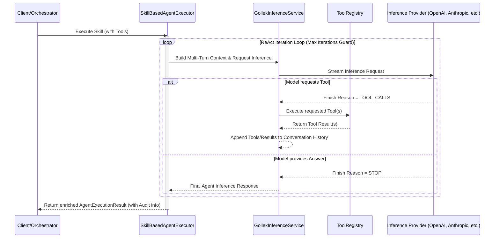

# ReAct Tool Execution Mechanism

Wayang AI has been upgraded to natively support **Reason and Act (ReAct)** style iterative tool execution. This allows agents to autonomously use tools and chain inferences together without any hardcoded logic.

---

## 🔁 The Iterative Loop Lifecycle

Tools in Wayang AI are exposed via the unified `ToolRegistry` and executed through the `SkillBasedAgentExecutor` and `GollekInferenceService`. At its core, an agent using tools goes through an autonomous reasoning loop:

1. **Inference Request**: The Agent executes an initial inference containing a system prompt, context, multi-turn conversation history, and the user's objective.
2. **LLM Tool Call**: If the agent decides it needs to take an action (e.g., fetch data, write a file, search the web), the inference model halts and returns a `TOOL_CALLS` finish reason representing the requested tools and arguments.
3. **Execution Execution**: Wayang captures these tool calls and seamlessly invokes the appropriate tools within the `ToolRegistry`.
4. **Observation & Context Extension**: Wayang records the execution result (or execution error) and appends it to the multi-turn memory graph as a `Tool Message`.
5. **Re-Inference**: Wayang loops back around to the Inference Model, supplying the fresh execution context. The agent "observes" the outcome and either requests further tools or decides it has enough context to satisfy the objective.

### Sequence Diagram: Tool Execution Loop



---

## 🛠️ Tracing and Multi-Turn Context

All context is retained across iteration loops automatically by appending past conversational turns to `AgentInferenceRequest.conversationHistory`.

Every loop effectively tracks:
- System Persona Prompt
- Past Iterations (The user input + agent outputs + tool execution outputs)
- Current prompt context

### Auditing Tool Output
To give observability into the decisions the LLM takes, the executor maintains an accurate audit trace in `AgentExecutionResult`.

```json
{
  "status": "SUCCESS",
  "content": "The weather in Seattle is rainy today.",
  "reactIterations": 2,
  "finishReason": "STOP",
  "toolExecutions": [
    {
       "toolName": "weather_api",
       "durationMs": 412,
       "error": null
    }
  ]
}
```

This ensures full transparency over agent tool behavior, latency, and success/failure characteristics without digging into debug logs.
