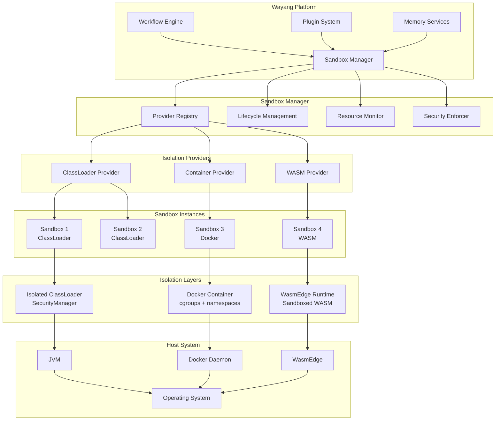
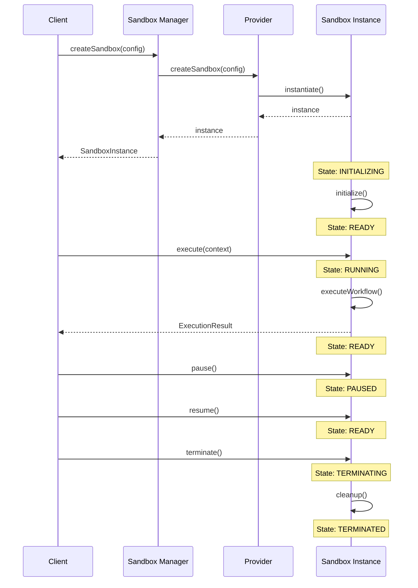
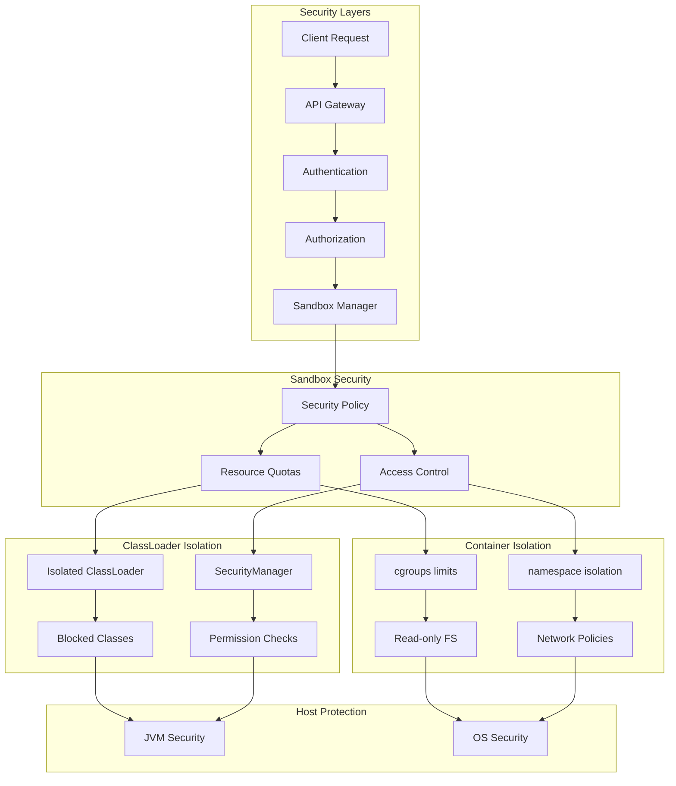
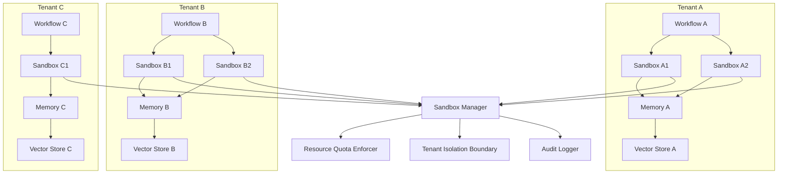
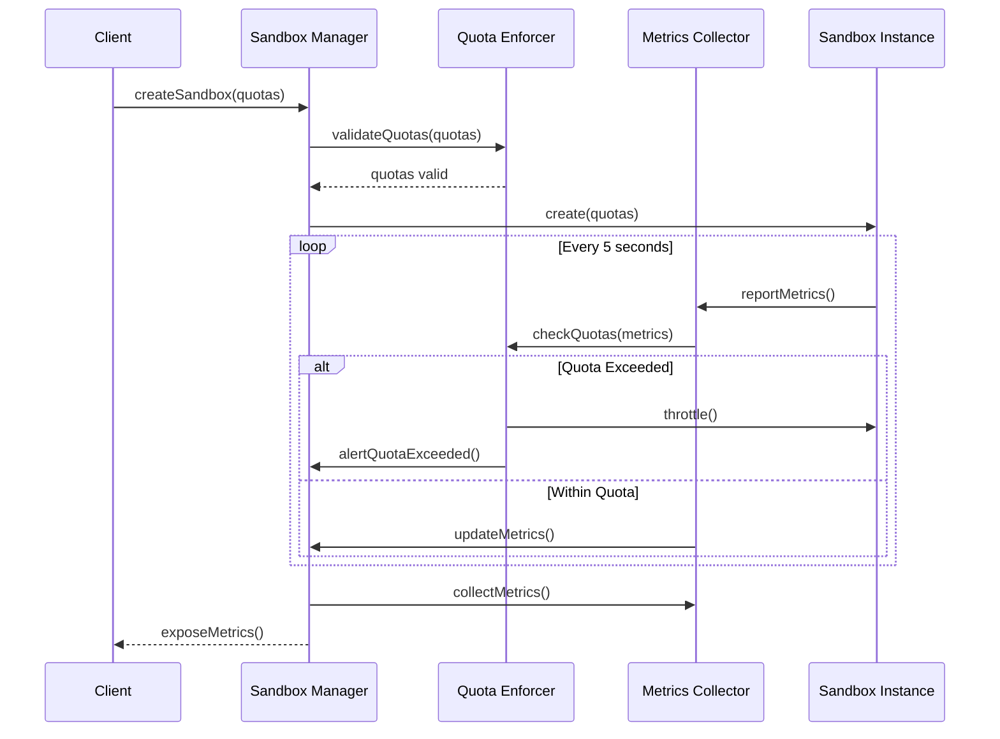
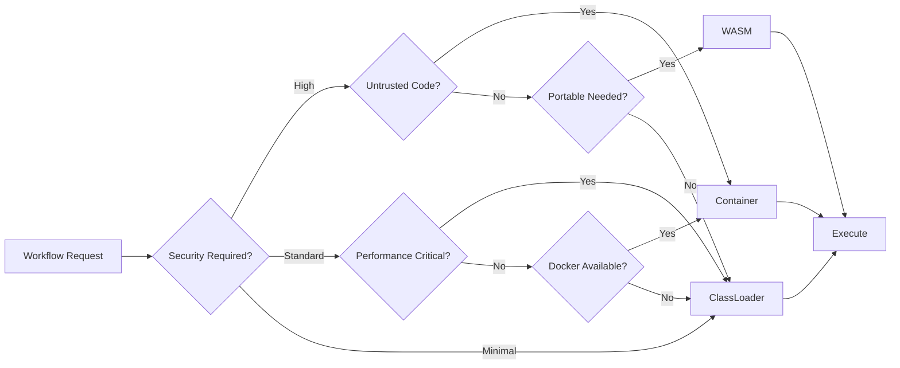
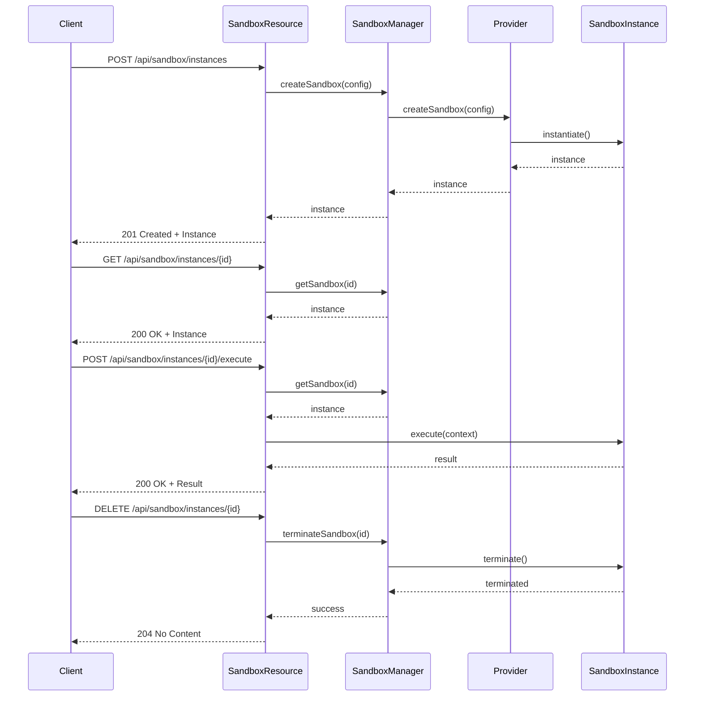
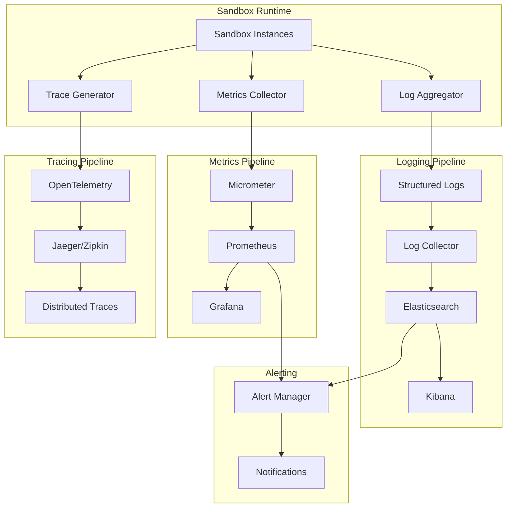
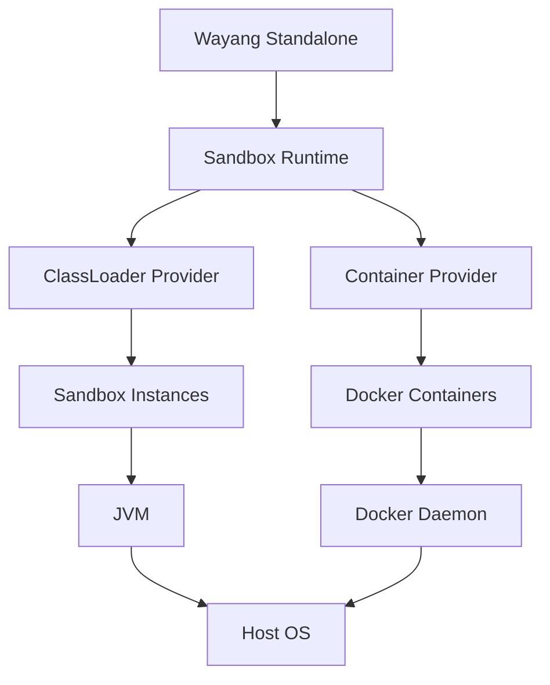
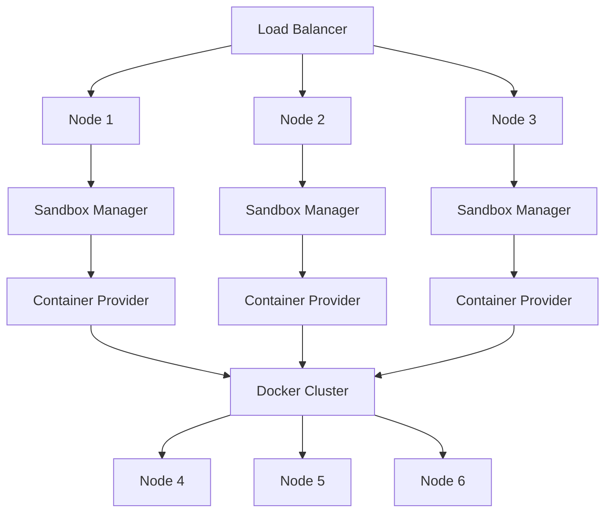

# Sandbox Runtime Architecture

Visual guide to the Wayang Sandbox Runtime architecture and components.

---

## High-Level Architecture

---

## Sandbox Lifecycle

---

## Security Architecture

---

## Multi-Tenant Architecture

---

## Resource Management Flow

---

## Provider Selection Strategy

---

## API Request Flow

---

## Observability Stack

---

## Deployment Patterns

### Single Node Deployment

### Multi-Node Cluster Deployment

---

[← Back to Sandbox Runtime](./sandbox-runtime.md)
